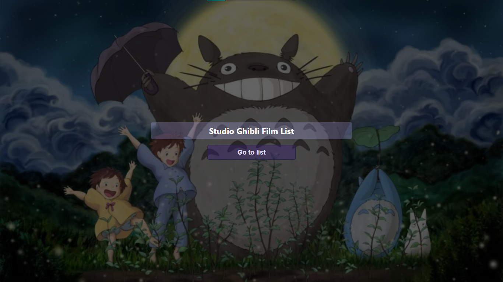
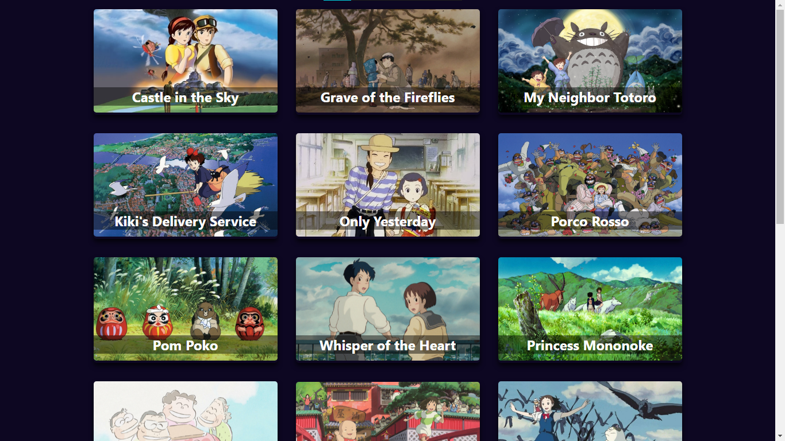
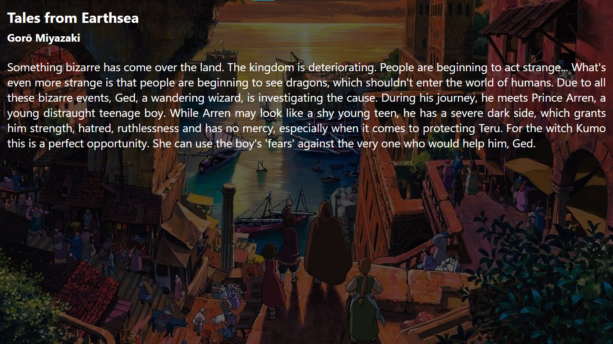

<h1 align="center">Catálogo de Filmes - Studio Ghibli</h1>

<h2 align="center">Tecnologias usadas</h2>

<h2 align="center">Index</h2>

<ul>
  <li><a href="#home">Tela inicial</a></li>
  <li><a href="#list">Lista de animações</a></li>
  <li><a href="#information">Tela com informações da animação</a></li>
</ul>

<h2 align="center">Descrição</h2>

Utilizando a API do estúdio Ghibli, foi feita esta página de catálogo das suas animações. O Studio Ghibli é um estúdio de animação japonês, fundado em 1985, o estúdio já produziu 21 longas de animação, sendo o primeiro O Castelo no Céu (1986). Os grandes fundadores se chamam Hayao Miyazaki, Isao Takahata, Toshio Suzuki e Yasuyoshi Tokuma. O logotipo da empresa é o Totoro, o personagem do filme Meu Amigo Totoro, lançado em 1988.

<h2 id="home" align="center">Tela inicial</h2>

Na tela inicial criei um design simples que direcionasse o usuário para a lista de animações. Esta tela esta responsiva, onde o titulo e a imagem de fundo varia de tamanho.

<h2 id="list" align="center">Tela com lista das animações</h2>

Nesta tela, foi listada todas as animações do estúdio Ghibli e se algum outro filme for lançado a lista atualizará. Cada item da lista leva a sua respectiva animação, indo para um <a href="#information">tela com informações</a>. Também trabalhei a responsividade desta página, onde a quantidade de colunas variam com o tamanho da tela, não foi usado Grid mas sim Flex box, em que o flex-wrap esta em wrap, que faz essa adaptação com mais facilidade.

<h2 id="information" align="center">Tela com informações da animação</h2>

Aqui vemos a tela com as informações da animação selecionada anteriormente na <a href="#list">listagem</a>. Na tela é mostrado o titulo do filme, o diretor e sua sinopse. Também inteiramente responsiva, onde a sinopse e a imagem de fundo variam com o tamanho da tela.

  🔗<a align="center" href="https://ghibli-catalog.vercel.app/">Link do projeto já hospedado</a>🔗

